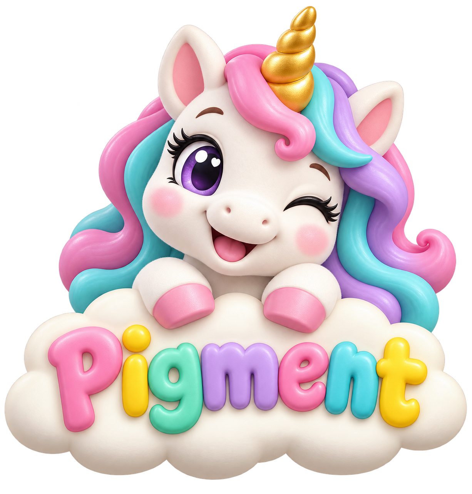
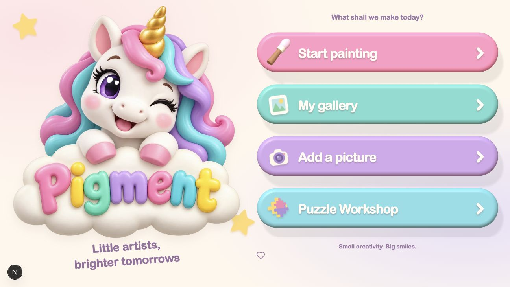
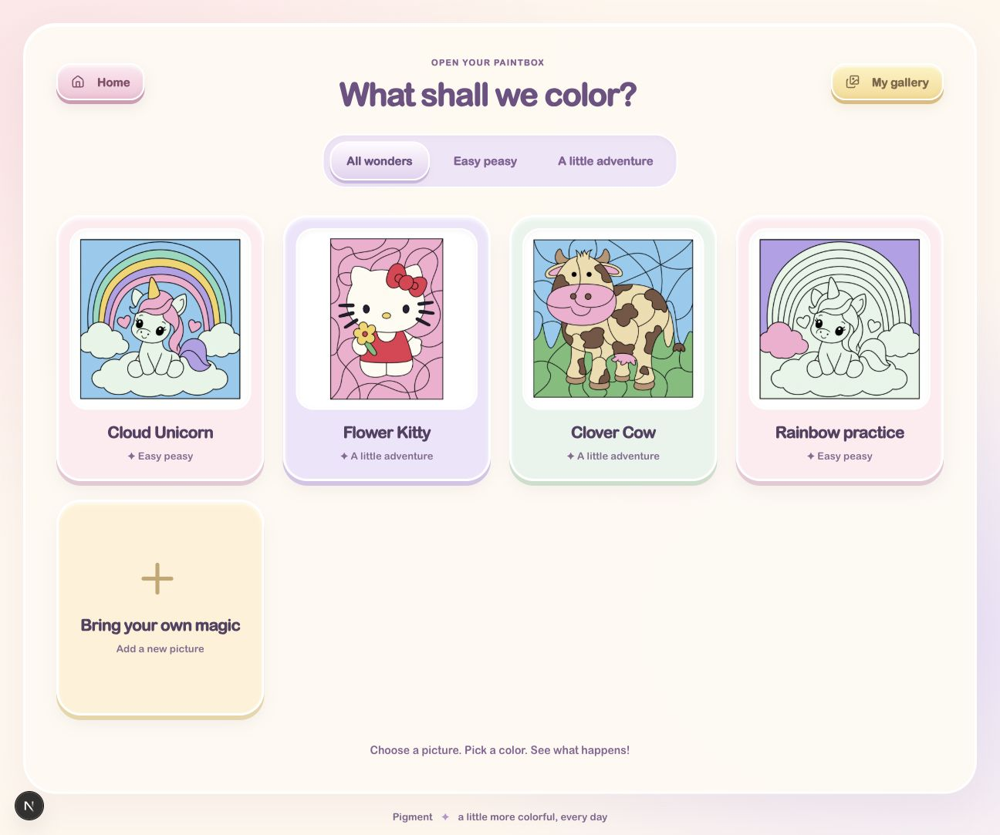
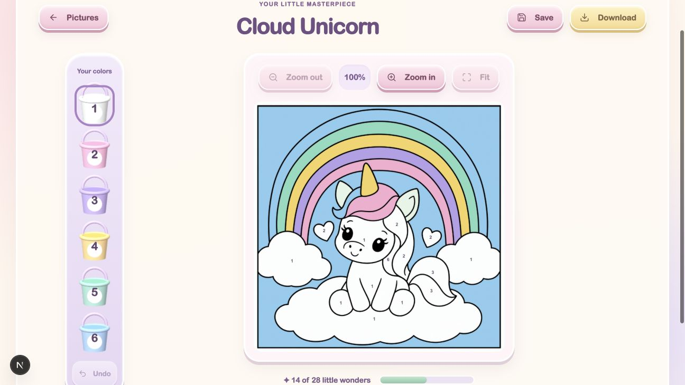
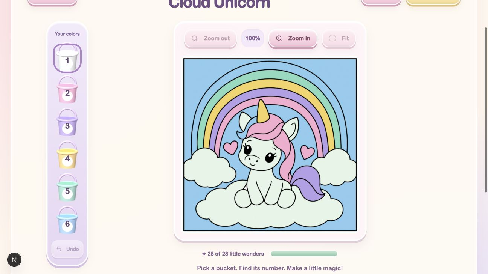
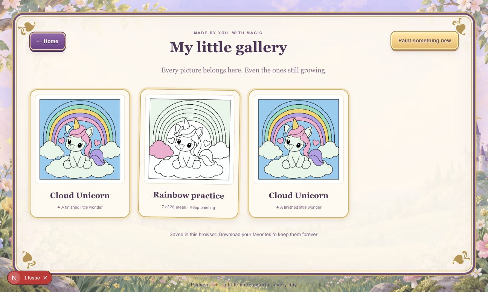
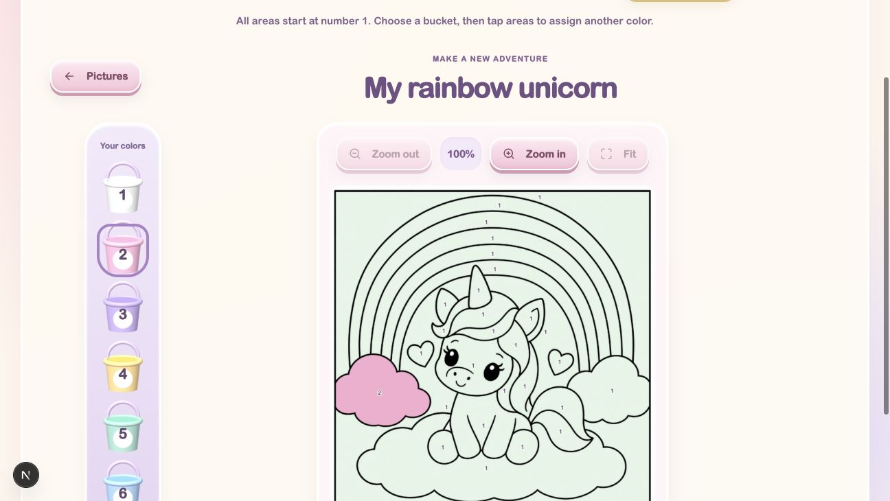

<p align="center">
  
</p>

# Pigment

**A little color. A little magic.**

An enchanted color-by-number game for little artists. Pick a picture, choose a paint bucket, and bring a tiny world to life—one numbered area at a time.

**[Open the paintbox →](https://pigment.sprioleau.dev)**



## A paintbox full of little wonders

- **Choose an adventure.** Cloud Unicorn, Flower Kitty, and Clover Cow, with difficulty filters and large picture cards.
- **Paint with a little magic.** Touch or click the HTML canvas. A brush cursor carries your selected color, and each correct fill sends out a burst of paint.
- **Get a closer look.** Zoom into small areas and pan around the artwork, then fit the picture back into view.
- **Take your time.** Gentle wrong-color hints, undo, and a gallery that keeps unfinished pictures ready to resume.
- **Keep your masterpiece.** Download a PNG whenever you like, with the painted artwork and no printed numbers or game controls.
- **Make another.** Paint again or choose a different picture after finishing.
- **Bring your own art.** Import line art, name it, and assign colors to its enclosed areas while previewing the result.
- **Fine-tune the puzzle.** A grown-up Puzzle Workshop edits palette colors, area assignments, number positions, and outline boundaries, with colored previews, region analysis, and undo.

| Pick a picture                                           | Make a little magic                                             |
| -------------------------------------------------------- | --------------------------------------------------------------- |
|  |  |

| A finished little wonder                                        | Your own gallery                                                 |
| --------------------------------------------------------------- | ---------------------------------------------------------------- |
|  |  |



## Made for small artists

Pigment’s **Puffy Paint Club** style brings together a big toy unicorn, pastel paint buckets, soft sculpted controls, and a cream-and-peach backdrop. The welcome screen uses Three.js for floating buttons and a projecting brush, with accessible HTML controls and a fallback when WebGL is unavailable. The layout adapts to phones and tablets, with zoom and panning for small areas. Paint bursts respect reduced-motion preferences. Region buttons are available only in the explicit `?debug=1` testing mode.

The [original interactive Three.js exploration](https://pigment.sprioleau.dev/explore/puffy) is also preserved for comparison.

On iPhone or iPad, open the game in Safari and choose **Share → Add to Home Screen**. Pigment includes a web app manifest and Apple home-screen icons for a standalone app experience.

[See the phone layout](public/screenshots/mobile.jpg) · [Read the design notes](docs/design.md)

## Run your own paintbox

Use Node.js 24 (recommended).

```sh
npm install
npm run dev
```

Open [localhost:3000](http://localhost:3000).

```sh
npm test
npm run lint
npm run build
npm start
```

Built with **Next.js 16.3.8**, React, TypeScript, and Tailwind CSS 4. Artwork is served from the repository; the game has no database dependency and needs no environment variables. PNG downloads use the `POST /api/export` endpoint.

## Saving and adding pictures

The gallery and imported pictures are stored **in this browser**. They do not sync between devices or browsers, and clearing browser storage removes them. Download favorite paintings to keep a separate copy. A cloud gallery, including Neon storage, has not been provisioned.

Imports accept PNG, JPEG, or WebP files up to 12 MB. Use clean black-and-white line art with thick, closed outlines and **no printed numbers**. Pigment discovers enclosed regions; a grown-up assigns their palette numbers before adding the picture to the paintbox. Photographs and drawings with open outlines are not suitable.

Open **Puzzle Workshop** from the main menu to edit any starter or imported picture. Save its changes to create a playable override in this browser. Existing gallery drawings keep the version they started with. Workshop edits do not publish to other devices or change the repository’s original artwork.

## Artwork credits

Cloud Unicorn is original Pigment artwork created with the built-in image generation tool. The user supplied the Hello Kitty and cow worksheets:

- **Flower Kitty:** [Creative Kids Color](https://www.creativekidscolor.com/wp-content/uploads/Hello-Kitty-Color-by-Number.png); Hello Kitty character by Sanrio.
- **Clover Cow:** [My Teaching Station](https://www.myteachingstation.com/vault/2599/web/worksheets/preschool/color-by-number/Color-by-Number-Printable-Worksheet-Cute-Cow.jpg), © 2021 My Teaching Station.

The supplied worksheets were cleaned for the game. Their redistribution licenses have not been verified; third-party artwork and characters remain credited to their respective owners. Source records are preserved in [source-art/sources.json](source-art/sources.json).
